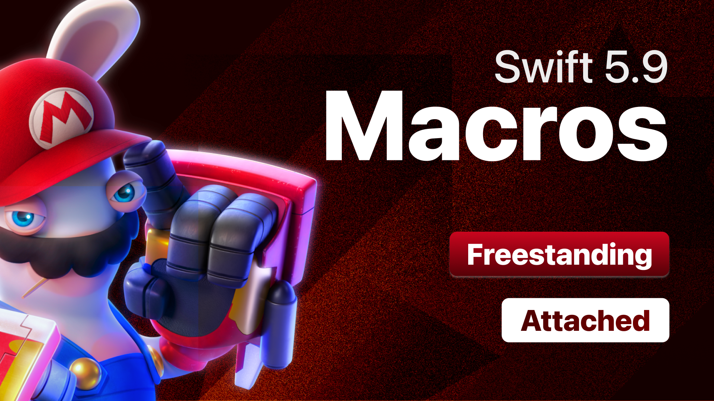

# MACROS - Swift 5.9

## What's Inside:
@freestanding(expression)
@freestanding(declaration)
@attached(peer, names: overloaded)
@attached(accessor)
@attached(member, names: named(dictionary))
@attached(memberAttribute)
@attached(extension, conformances: Equatable, names: named(value))

And also XCTestCase for each cases

## SPECIAL THANKS TO

Antoine v.d. Swiftlee
Ömer Ulusal
Alex Hoppen
Tim Wang
강수진, sujinnaljin, Presentation at KDWC23
Kishikawa Katsumi
Nicola Lancellotti
Matt Rothenberg
B. Royal Gordon
Anıl Taşkıran
Jullian Mercier
Pedro Rojas
Maxim Krouk
